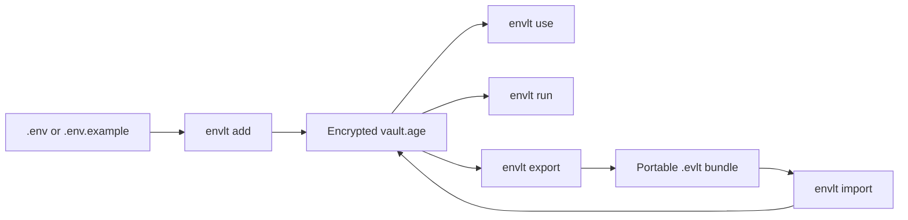

# envlt

`envlt` is a local-first Rust CLI for managing environment variables in an encrypted vault, materializing `.env` files on demand, and sharing project snapshots through portable `.evlt` bundles.

## Status

The implementation is beyond the original Phase 1 scope:

- Phase 1: complete and extended
- Phase 2: implemented
- Phase 3: partially implemented and already usable

The project is currently in the hardening and release-engineering stage before public distribution.

## Current capabilities

- Encrypted local vault backed by `age`
- Atomic vault writes with a basic `vault.age.bak` backup
- Import from `.env` and `.env.example`
- Project resolution through `.envlt-link`
- Variable typing with `Secret`, `Config`, and `Plain`
- Variable inspection with secret masking
- Project-to-example and project-to-project diffing
- Secret generation with presets, guided interactive flow, and secure-by-default storage
- Project export and import via `.evlt` bundles
- Local diagnostics through `envlt doctor`
- Process execution with in-memory environment injection

## Quick start

```bash
envlt init
envlt add api-payments
envlt vars --project api-payments
envlt set --project api-payments PORT=4000
envlt use --project api-payments
envlt run --project api-payments -- node server.js
envlt export api-payments --out bundle.evlt
envlt import bundle.evlt
envlt doctor --decrypt
envlt gen --type jwt-secret --set JWT_SECRET --project api-payments
envlt gen --type jwt-secret --set JWT_SECRET --project api-payments --show
```

If the current directory contains `.envlt-link`, several commands can resolve the project automatically: `vars`, `diff`, `set`, `use`, `run`, and part of the `gen` flow.

## Installation

Homebrew packaging is planned but not published yet. Today, the supported installation path is Cargo:

```bash
cargo install --path crates/envlt-cli
envlt --help
```

For development usage directly from the repository:

```bash
cargo run -p envlt-cli -- --help
```

## How it works



## Command overview

| Command | Purpose |
| --- | --- |
| `envlt init` | Create the encrypted local vault |
| `envlt add` | Import variables from `.env` or `.env.example` |
| `envlt list` | List stored projects |
| `envlt vars` | Show project variables and their types |
| `envlt diff` | Compare against `.env.example` or another project |
| `envlt set` | Create or update variables |
| `envlt use` | Materialize a `.env` file |
| `envlt run` | Run a child process with injected variables |
| `envlt gen` | Generate secure values and optionally store them |
| `envlt export` | Export a project to `.evlt` |
| `envlt import` | Import a `.evlt` bundle |
| `envlt doctor` | Diagnose vault and project-link state |

## Security model

- The source of truth is an encrypted local vault at `~/.envlt/vault.age`
- Bundles use a passphrase separate from the main vault passphrase
- `envlt run` avoids writing `.env` files to disk
- `vars` masks `Secret` values
- `diff` reports categorized changes without printing values
- `gen --set` does not reveal generated values unless `--show` is used

See the full security notes in [Documentation Index](docs/README.md).

## Documentation

Start with the docs index:

- [Documentation Index](docs/README.md)

Primary documents:

- [Getting Started](docs/getting-started.md)
- [CLI Reference](docs/cli-reference.md)
- [Architecture](docs/architecture.md)
- [Security](docs/security.md)
- [Roadmap](docs/roadmap.md)
- [Spec Alignment](docs/spec-alignment.md)

## Development quality gates

```bash
cargo fmt --all
cargo clippy --all-targets --all-features -- -D warnings
cargo test
```
