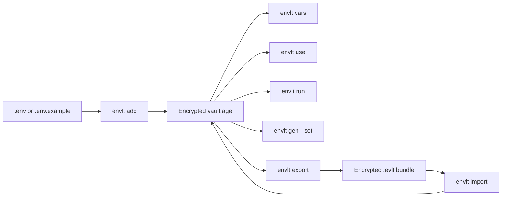

# envlt

<p align="center">
  <strong>Local-first environment variable management for development workflows.</strong>
</p>

<p align="center">
  Encrypted vault. Portable bundles. Regenerable <code>.env</code> files. No cloud dependency required.
</p>

<p align="center">
  <a href="https://github.com/obsidia-systems/envlt/actions/workflows/ci.yml"></a>
  <a href="LICENSE"></a>
  <a href="https://github.com/obsidia-systems/envlt"></a>
  <a href="https://www.rust-lang.org/"></a>
</p>

## Overview

`envlt` is a Rust CLI for storing project environment variables inside an encrypted local vault instead of keeping secrets in plaintext `.env` files.

It is designed for the local development use case:

- import existing `.env` files
- bootstrap from `.env.example`
- regenerate `.env` files only when needed
- run commands with in-memory injected variables
- export/import portable encrypted project bundles

## Why `envlt`

- Local-first: no account, no remote service, no required network dependency
- Safer by default: encrypted vault, masked secret output, secure generator behavior
- Portable: share project snapshots with `.evlt` bundles
- Practical: use `run`, `use`, `diff`, `vars`, `gen`, and `doctor` from a single CLI

## Status

Current implementation state:

- Phase 1: complete and extended
- Phase 2: implemented
- Phase 3: implemented for the current packaging milestone

Still intentionally out of scope for now:

- cloud sync
- Keychain integration
- GUI app

## Features

- encrypted local vault using `age`
- atomic writes with `vault.age.bak` backup
- `.env` and `.env.example` import
- `.envlt-link` project resolution
- typed variables: `Secret`, `Config`, `Plain`
- secret-aware variable listing
- project-to-example and project-to-project diffing
- secure secret generation with interactive flow
- encrypted `.evlt` export/import
- local diagnostics through `envlt doctor`

## Quick Start

```bash
envlt init
envlt add api-payments
envlt vars --project api-payments
envlt set --project api-payments PORT=4000
envlt use --project api-payments
envlt run --project api-payments -- node server.js
envlt export api-payments --out bundle.evlt
envlt import bundle.evlt
envlt doctor --decrypt
envlt gen --type jwt-secret --set JWT_SECRET --project api-payments
envlt gen --type jwt-secret --set JWT_SECRET --project api-payments --show
```

If the current directory contains `.envlt-link`, these commands can resolve the project automatically:

- `vars`
- `diff`
- `set`
- `use`
- `run`
- interactive `gen` save flow

## Installation

### Current supported path

Homebrew packaging is not published yet. Today the supported installation path is Cargo:

```bash
cargo install --path crates/envlt-cli
envlt --help
```

### Development usage from the repository

```bash
cargo run -p envlt-cli -- --help
```

## How It Works



## Command Overview

| Command | Purpose |
| --- | --- |
| `envlt init` | Create the encrypted local vault |
| `envlt add` | Import variables from `.env` or `.env.example` |
| `envlt list` | List stored projects |
| `envlt vars` | Show project variables and types |
| `envlt diff` | Compare against `.env.example` or another project |
| `envlt set` | Create or update variables |
| `envlt use` | Materialize a `.env` file |
| `envlt run` | Execute a child process with injected variables |
| `envlt gen` | Generate secure values and optionally store them |
| `envlt export` | Export a project to `.evlt` |
| `envlt import` | Import a `.evlt` bundle |
| `envlt doctor` | Diagnose vault and `.envlt-link` state |

## Security Notes

- the source of truth is an encrypted local vault at `~/.envlt/vault.age`
- `envlt run` avoids writing `.env` files to disk
- bundles use a passphrase independent from the main vault passphrase
- `vars` masks `Secret` values
- `diff` reports categorized changes without printing values
- `gen --set` does not reveal generated values unless `--show` is explicitly used

For details, see [Security](docs/security.md).

## Documentation

Start with:

- [Documentation Index](docs/README.md)

Primary documents:

- [Getting Started](docs/getting-started.md)
- [CLI Reference](docs/cli-reference.md)
- [Architecture](docs/architecture.md)
- [Security](docs/security.md)
- [Roadmap](docs/roadmap.md)
- [Spec Alignment](docs/spec-alignment.md)
- [Contributing](CONTRIBUTING.md)
- [Changelog](CHANGELOG.md)

## Development

Quality gates:

```bash
cargo fmt --all
cargo clippy --all-targets --all-features -- -D warnings
cargo test
```

Repository release baseline already includes:

- CI on Linux and macOS
- release workflow scaffolding for tagged builds

## Road to Homebrew

What is already ready:

- project documentation
- license
- changelog
- contributor guide
- CI workflow
- release workflow skeleton

What still remains:

- publish the repository and validate GitHub Actions in the remote repo
- create the first tagged release and inspect generated artifacts
- define the Homebrew formula/tap around those published artifacts
