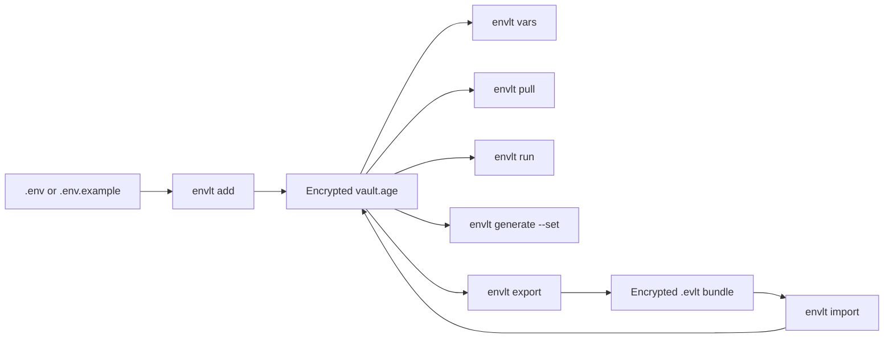

# envlt

<p align="center">
  <strong>Local-first environment variable management for development workflows.</strong>
</p>

<p align="center">
  Encrypted vault. Portable bundles. Regenerable <code>.env</code> files. No cloud dependency required.
</p>

<p align="center">
  <a href="https://github.com/obsidia-systems/envlt/actions/workflows/ci.yml"></a>
  <a href="https://github.com/obsidia-systems/envlt/releases/latest"></a>
  <a href="LICENSE"></a>
  <a href="https://github.com/obsidia-systems/envlt"></a>
  <a href="https://www.rust-lang.org/"></a>
</p>

## Table of Contents

- [Overview](#overview)
- [Problem](#problem)
- [Mental Model](#mental-model)
- [Why `envlt`](#why-envlt)
- [Quick Comparison](#quick-comparison)
- [Features](#features)
- [Installation](#installation)
- [Quick Start](#quick-start)
- [How It Works](#how-it-works)
- [Command Overview](#command-overview)
- [Security](#security)
- [Documentation](#documentation)
- [Project Status](#project-status)
- [Contributing](#contributing)
- [License](#license)

## Overview

`envlt` is a Rust CLI for storing project environment variables inside an encrypted local vault instead of keeping secrets in plaintext `.env` files.

It is designed for the local development use case:

- import existing `.env` files
- bootstrap from `.env.example`
- regenerate `.env` files only when needed
- run commands with in-memory injected variables
- export/import portable encrypted project bundles

## Problem

The usual `.env` workflow creates avoidable friction:

- plaintext secrets remain on disk
- onboarding depends on manual copy and edit steps
- local state drifts across machines and teammates
- accidental commits happen when `.env` changes are mixed into normal work
- AI coding assistants (Claude Code, Cursor, Copilot, and similar tools) routinely read project files as part of normal operation and don't distinguish a `.env` file from any other file in the repo -- a plaintext secret sitting on disk is exposure surface, whether or not you ever ran `git add`

`envlt` turns this into an encrypted, repeatable workflow with clear control points.

## Mental Model

`envlt` replaces this:

`.env` -> plaintext -> manual -> error-prone

with this:

`vault` -> encrypted -> reproducible -> controlled

The encrypted vault is your source of truth. `.env` files become generated artifacts only when needed.

Before:

```bash
cp .env.example .env
nano .env
```

After:

```bash
envlt pull api-payments
envlt run node server.js
```

## Why `envlt`

- Local-first: no account, no remote service, no required network dependency
- Safer by default: encrypted vault, masked secret output, secure generator behavior
- Multi-environment: `local`, `staging`, `prod`, ... fully isolated, no accidental inheritance
- Portable: share project snapshots with `.evlt` bundles
- Practical: use `run`, `pull`, `diff`, `vars`, `get`, `history`, `generate`, `doctor`, and `auth` from a single CLI
- Built for the AI-agent era: `envlt run` injects variables into a process without ever writing a `.env` file, and `envlt doctor` warns if one is left lying around next to a linked project

## Quick Comparison

| Workflow need | Typical `.env` approach | `envlt` approach |
| --- | --- | --- |
| Local secret storage | plaintext file on disk | encrypted local vault |
| Team handoff | copy/paste or shared files | encrypted `.evlt` bundle |
| Run app locally | depends on current `.env` state | deterministic with `envlt run` |
| Regenerate files | manual edits and drift risk | `envlt pull` from vault state |
| Per-environment config | separate `.env.staging`, `.env.prod` files | `--env` on any command, same vault |
| Change history | none, unless you grep Git history for a deleted line | `envlt history`, per variable |
| Offline usage | yes | yes |

## Features

- encrypted local vault using `age`
- atomic writes with `vault.age.bak` + rotated backups
- `.env` and `.env.example` import
- `.envlt-link` project resolution, including from monorepo subdirectories
- typed variables: `Secret`, `Plain`
- multiple named environments per project, fully isolated (no inheritance)
- full per-variable version history, reconstructed on demand (`envlt history`)
- optional system keyring support for vault passphrase reuse
- secret-aware variable listing and single-value scripting (`envlt get`)
- project removal with confirmation
- project-to-example and project-to-project (or environment-to-environment) diffing
- secure secret generation with an interactive flow
- encrypted `.evlt` export/import, scoped to one environment at a time
- shell completions (bash, zsh, fish, powershell, elvish) and generated man pages
- local diagnostics through `envlt doctor`

## Installation

Homebrew is the recommended install path:

```bash
brew install obsidia-systems/tap/envlt
envlt --help
```

Cargo, for contributors and local development:

```bash
cargo install --path crates/envlt-cli
envlt --help
```

Manual install from [GitHub Releases](https://github.com/obsidia-systems/envlt/releases/latest):

```bash
tar -xzf envlt-linux-x86_64.tar.gz
chmod +x envlt
sudo mv envlt /usr/local/bin/envlt
envlt --help
```

On macOS, you may need to remove the quarantine attribute from a manually downloaded binary before first run: `xattr -d com.apple.quarantine ./envlt`.

Windows users: run `envlt` under WSL. Native Windows packaging and Apple notarization aren't on the current roadmap -- see [Roadmap](docs/roadmap.md).

## Quick Start

```bash
envlt init
envlt auth save
envlt add api-payments
envlt run --project api-payments -- node server.js
```

Then move into common tasks:

```bash
envlt vars --project api-payments
envlt pull --project api-payments
envlt set --project api-payments PORT=4000
envlt export api-payments --out bundle.evlt
envlt import bundle.evlt
envlt doctor --decrypt
```

Secret generation:

```bash
envlt generate --type jwt-secret --set JWT_SECRET --project api-payments
envlt generate --type jwt-secret --set JWT_SECRET --project api-payments --show
```

If the current directory contains `.envlt-link`, these commands resolve the project (and environment) automatically, so `--project`/`--env` can be omitted:

- `vars`, `get`, `set`, `unset`, `history`
- `diff`, `check`
- `pull`, `run`
- `generate`'s interactive save flow

## How It Works


```mermaid
flowchart LR
    A[.env or .env.example] --> B[envlt add]
    B --> C[Encrypted vault.age]
    C --> D[envlt vars]
    C --> E[envlt pull]
    C --> F[envlt run]
    C --> G[envlt generate --set]
    C --> H[envlt export]
    H --> I[Encrypted .evlt bundle]
    I --> J[envlt import]
    J --> C
```

## Command Overview

| Command | Purpose |
| --- | --- |
| `envlt init` | Create the encrypted local vault |
| `envlt add` | Import variables from `.env` or `.env.example` |
| `envlt list` | List stored projects |
| `envlt remove` | Remove a stored project |
| `envlt env` | List, add, remove, or switch a project's environments |
| `envlt vars` | Show project variables and types |
| `envlt get` | Print a single variable's raw value, for scripting |
| `envlt set` | Create or update variables |
| `envlt unset` | Delete a variable |
| `envlt run` | Execute a child process with injected variables |
| `envlt pull` | Materialize a `.env` file |
| `envlt generate` | Generate secure values and optionally store them |
| `envlt export` | Export a project environment to `.evlt` |
| `envlt import` | Import a `.evlt` bundle |
| `envlt check` | Verify a project against `.env.example` |
| `envlt diff` | Compare against `.env.example` or another project/environment |
| `envlt history` | Show version history for a project or variable |
| `envlt doctor` | Diagnose vault and `.envlt-link` state |
| `envlt completions` | Generate shell completion scripts |
| `envlt man` | Generate man pages |
| `envlt auth` | Manage stored vault authentication |

Every command's full flag list and examples are also available via `envlt <command> --help`, and mirrored in the [CLI Reference](docs/cli-reference.md).

## Security

- the source of truth is an encrypted local vault at `~/.envlt/vault.age`
- vault passphrases can optionally be stored in the system keyring for the current `ENVLT_HOME`
- `envlt run` avoids writing `.env` files to disk -- nothing for an AI coding assistant or any other tool scanning the working directory to read
- `envlt doctor` warns when a `.env` file is found next to a resolved `.envlt-link`
- bundles use a passphrase independent from the main vault passphrase, and carry exactly one environment at a time
- `vars` masks `Secret` values
- `diff` reports categorized changes without printing values
- `generate --set` does not reveal generated values unless `--show` is explicitly used

For the full model, see [Security](docs/security.md) and [Threat Model](docs/threat-model.md).

## Documentation

Start with:

- [Documentation Index](docs/README.md)
- [Getting Started](docs/getting-started.md)
- [Troubleshooting](docs/troubleshooting.md)

Reference:

- [CLI Reference](docs/cli-reference.md)
- [Architecture](docs/architecture.md)
- [Security](docs/security.md)
- [Threat Model](docs/threat-model.md)
- [Integrations](docs/integrations.md)
- [Roadmap](docs/roadmap.md)
- [Changelog](CHANGELOG.md)

## Project Status

`envlt` is under active development. The core local workflow is implemented and used daily by its maintainer: encrypted vault, multiple environments, full version history, `.evlt` bundle sharing, secret generation, shell completions/man pages, and diagnostics.

Not implemented, and not currently planned:

- cloud sync
- a GUI application

See [Roadmap](docs/roadmap.md) for what's actually next.

## Contributing

Bug reports, feature ideas, and pull requests are welcome. Start with [CONTRIBUTING.md](CONTRIBUTING.md) for local setup, coding conventions, the documentation policy, and the PR checklist (`make check` must pass before review).

## License

`envlt` is licensed under the [MIT License](LICENSE).
