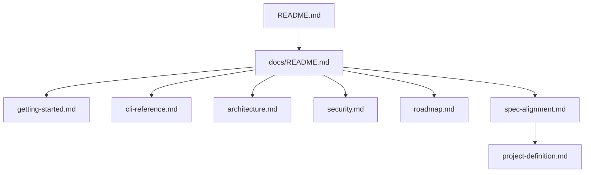

# Documentation Index

This directory contains the current technical documentation for `envlt`.

## Recommended reading order

1. [Getting Started](getting-started.md)
2. [CLI Reference](cli-reference.md)
3. [Architecture](architecture.md)
4. [Security](security.md)
5. [Roadmap](roadmap.md)
6. [Spec Alignment](spec-alignment.md)
7. [Contributing](../CONTRIBUTING.md)
8. [Changelog](../CHANGELOG.md)

Historical source document:

- [Original Project Definition](project-definition.md)

## Documentation map

## Document roles

| Document | Purpose |
| --- | --- |
| `getting-started.md` | Installation, first-run workflow, and common usage paths |
| `cli-reference.md` | Command-by-command reference |
| `architecture.md` | Core design, storage model, and runtime flow |
| `security.md` | Current security model and operational guidance |
| `roadmap.md` | What is still missing and what is planned next |
| `spec-alignment.md` | Verification of the current implementation against the original specification |
| `../CONTRIBUTING.md` | Contributor expectations and local development workflow |
| `../CHANGELOG.md` | Project-level change history |

## Documentation principles

This documentation set is intentionally:

- implementation-driven
- technical rather than promotional
- consolidated to avoid fragmented partial explanations
- explicit about what is implemented versus planned
