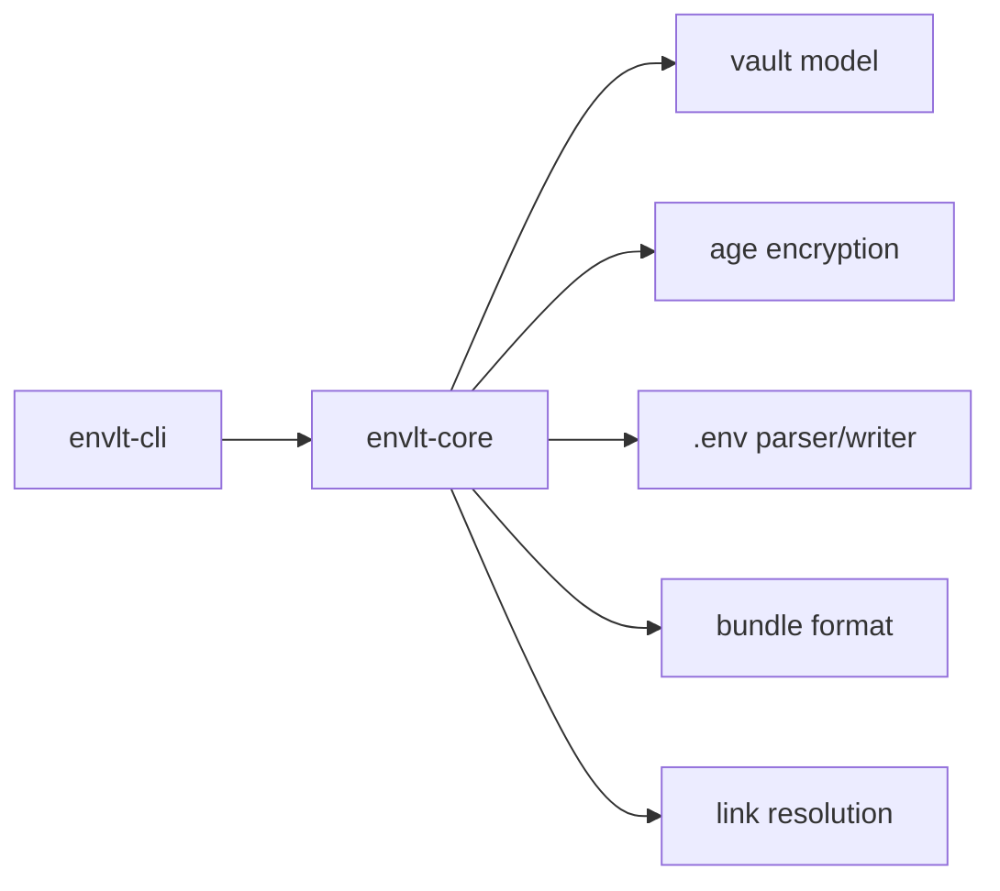
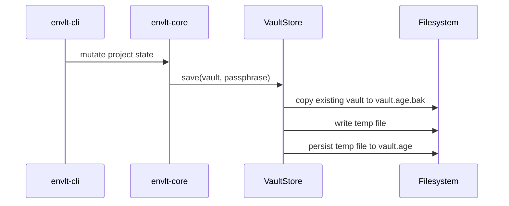
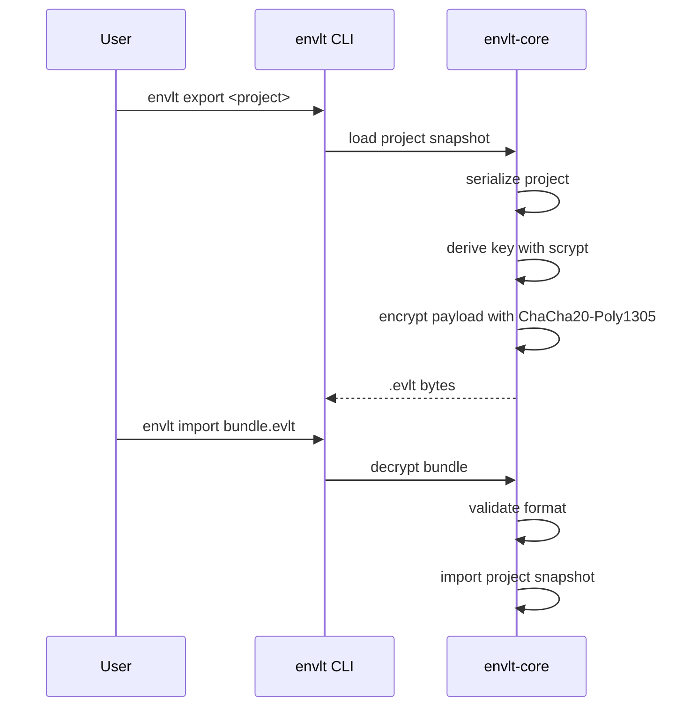

# Architecture

This document describes the current implemented architecture, not the aspirational end-state from the original project definition.

## Workspace layout

```text
envlt/
├── Cargo.toml
├── crates/
│   ├── envlt-core/
│   └── envlt-cli/
└── docs/
```

## Component overview



## Design principles in the current implementation

- domain logic lives in `envlt-core`
- the CLI layer primarily handles argument parsing and user interaction
- vault writes are atomic
- format evolution is versioned
- project resolution is explicit or link-based

## Runtime flows

### Vault write flow



### Bundle flow



## Implemented storage model

Core domain types:

- `VaultData`
- `Project`
- `Variable`
- `VarType`
- `ActivityEvent`
- `ActivityAction`

Current `VarType` values:

- `Secret`
- `Config`
- `Plain`

Each `Project` maintains an `activity_log` (`Vec<ActivityEvent>`) that records variable lifecycle events. The log is part of the encrypted vault and travels with `.evlt` bundles. It survives variable deletion because it lives at the project level, not inside each `Variable`.

## Implemented persistence guarantees

- encrypted vault file
- basic version validation
- atomic write path through a temporary file
- automatic backup copy before overwrite

## Implemented CLI-to-core split

### `envlt-core`

Responsibilities:

- vault persistence
- encryption and decryption
- `.env` parsing and rendering
- bundle serialization
- project link resolution
- diffing and diagnostics
- generator logic

### `envlt-cli`

Responsibilities:

- command-line interface with `clap`
- prompts and interactive flow
- printing user-facing output
- passing validated input into the core service

## Not yet implemented

- cloud provider abstraction
- merge engine for external vaults
- migration subsystem beyond current version validation
- Keychain integration
- GUI crate
