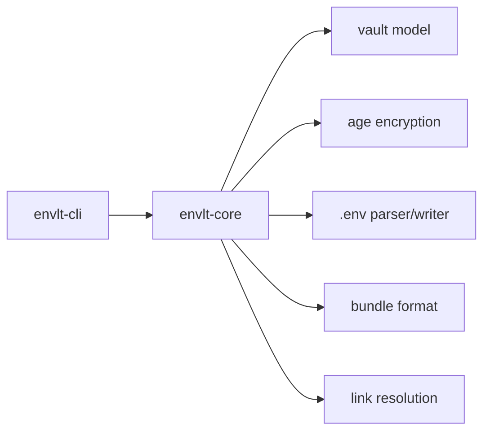
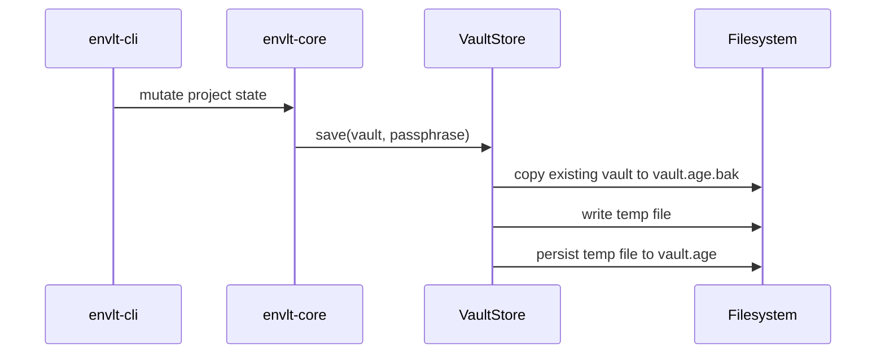
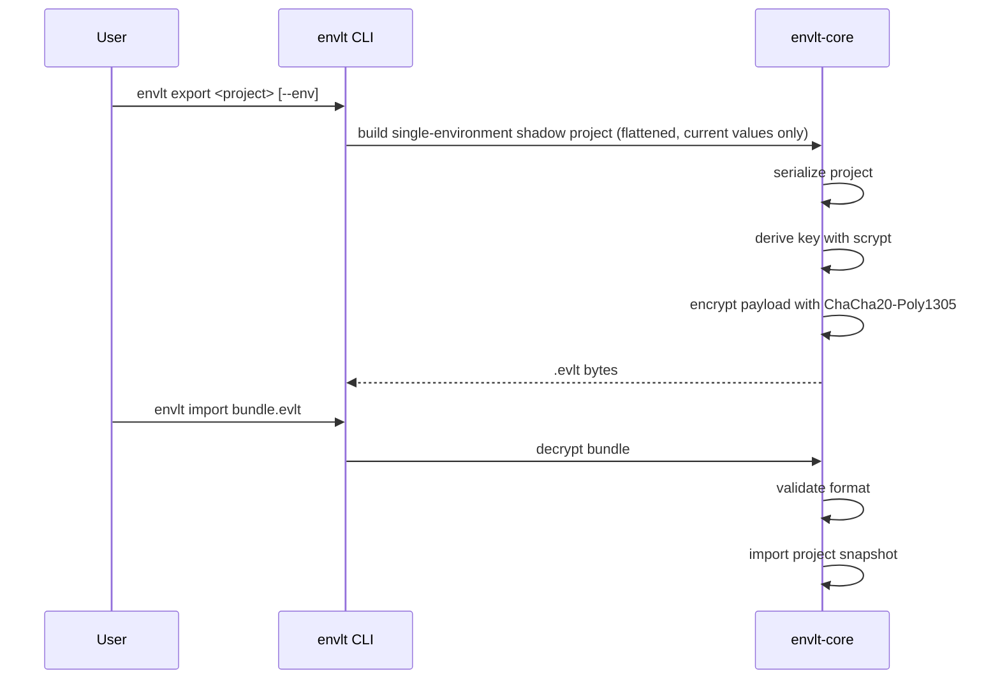

# Architecture

This document describes the current implemented architecture, not the aspirational end-state from the original project definition.

## Workspace layout

```text
envlt/
├── Cargo.toml
├── crates/
│   ├── envlt-core/
│   └── envlt-cli/
└── docs/
```

## Component overview


```mermaid
flowchart LR
    A[envlt-cli] --> B[envlt-core]
    B --> C[vault model]
    B --> D[age encryption]
    B --> E[.env parser/writer]
    B --> F[bundle format]
    B --> G[link resolution]
```

## Design principles in the current implementation

- domain logic lives in `envlt-core`
- the CLI layer primarily handles argument parsing and user interaction
- vault writes are atomic
- format evolution is versioned
- project resolution is explicit or link-based

## Runtime flows

### Vault write flow


```mermaid
sequenceDiagram
    participant CLI as envlt-cli
    participant Core as envlt-core
    participant Store as VaultStore
    participant FS as Filesystem

    CLI->>Core: mutate project state
    Core->>Store: save(vault, passphrase)
    Store->>FS: copy existing vault to vault.age.bak
    Store->>FS: write temp file
    Store->>FS: persist temp file to vault.age
```

### Bundle flow


```mermaid
sequenceDiagram
    participant U as User
    participant CLI as envlt CLI
    participant Core as envlt-core

    U->>CLI: envlt export <project> [--env]
    CLI->>Core: build single-environment shadow project (flattened, current values only)
    Core->>Core: serialize project
    Core->>Core: derive key with scrypt
    Core->>Core: encrypt payload with ChaCha20-Poly1305
    Core-->>CLI: .evlt bytes

    U->>CLI: envlt import bundle.evlt
    CLI->>Core: decrypt bundle
    Core->>Core: validate format
    Core->>Core: import project snapshot
```

## Implemented storage model

Core domain types:

- `VaultData`
- `Project` -- a name, an optional path, and a `BTreeMap<String, Environment>`
- `Environment` -- a name (e.g. `local`, `staging`, `prod`) and a `BTreeMap<String, Variable>`
- `Variable` -- an optional description, a tombstone (`deleted_at`), and a `Vec<VariableVersion>`
- `VariableVersion` -- one historical `(value, var_type, created_at)`
- `VarType`
- `ActivityEvent`
- `ActivityAction`

Current `VarType` values:

- `Secret` -- masked in output unless explicitly revealed
- `Plain` -- shown in full in output

`Config` existed as a third value historically but was merged into `Plain` since nothing in the codebase ever treated them differently. Old vaults and bundles with a stored `Config` value still deserialize correctly (`#[serde(alias = "Config")]` on `Plain`) and are rewritten as `Plain` the next time they are saved.

### Environments

Variables live under an `Environment`, not directly on a `Project`: every project has at least one (`local`, seeded on `add`/`init`), and `envlt env add <name>` creates more (e.g. `staging`, `prod`). Variables are **fully duplicated per environment** -- there is no project-level default that environments inherit from, so a variable's meaning never depends on where in a lookup chain it was found. `envlt export` bundles exactly one environment at a time (see below), so sharing a bundle can never leak more than one environment's state.

### Version history

Each `Variable` keeps its full value history in `versions` (oldest to newest), for both `Secret` and `Plain` types alike -- see `docs/security.md` for the trade-off this implies. `AppService::set_variable` appends a version via `Variable::record`, which trims the list down to `Config::max_versions` (default 10, oldest dropped first). Unsetting a variable sets `deleted_at` (a tombstone) rather than removing it from the map, so its version history survives deletion; setting it again clears the tombstone and continues the same history rather than starting a new one.

There is no longer a separately stored `activity_log`. `envlt history` is reconstructed on demand by `vault::synthesize_variable_events`, which diffs each variable's adjacent `VariableVersion`s (and appends a synthetic `VariableDeleted` if tombstoned) into the same `ActivityEvent` shape the old hand-maintained log used. This removes a class of bugs where the log and the actual data could drift out of sync, since there is now only one source of truth.

## Implemented persistence guarantees

- encrypted vault file, restricted to `0700`/`0600` on Unix
- versioned vault format with a dedicated migration module (`vault/migration.rs`); a vault older than the current version is migrated on load, with the pre-migration ciphertext preserved as `vault.v{old}.pre-migration.age`, and a vault outside the supported version range is rejected
- atomic write path through a temporary file, fsynced before rename
- automatic backup copy before overwrite
- cross-process advisory lock (`VaultStore::lock`) around read-modify-write sequences
- optional system keychain storage of the vault passphrase (macOS Keychain, Windows Credential Manager, Linux Secret Service via `keyring`), scoped per `ENVLT_HOME`

## Implemented CLI-to-core split

### `envlt-core`

Responsibilities:

- vault persistence
- encryption and decryption
- `.env` parsing and rendering
- bundle serialization
- project link resolution
- diffing and diagnostics
- generator logic

### `envlt-cli`

Responsibilities:

- command-line interface with `clap`
- prompts and interactive flow
- printing user-facing output
- passing validated input into the core service

## Not yet implemented

- cloud provider abstraction
- merge engine for external vaults
- GUI crate
