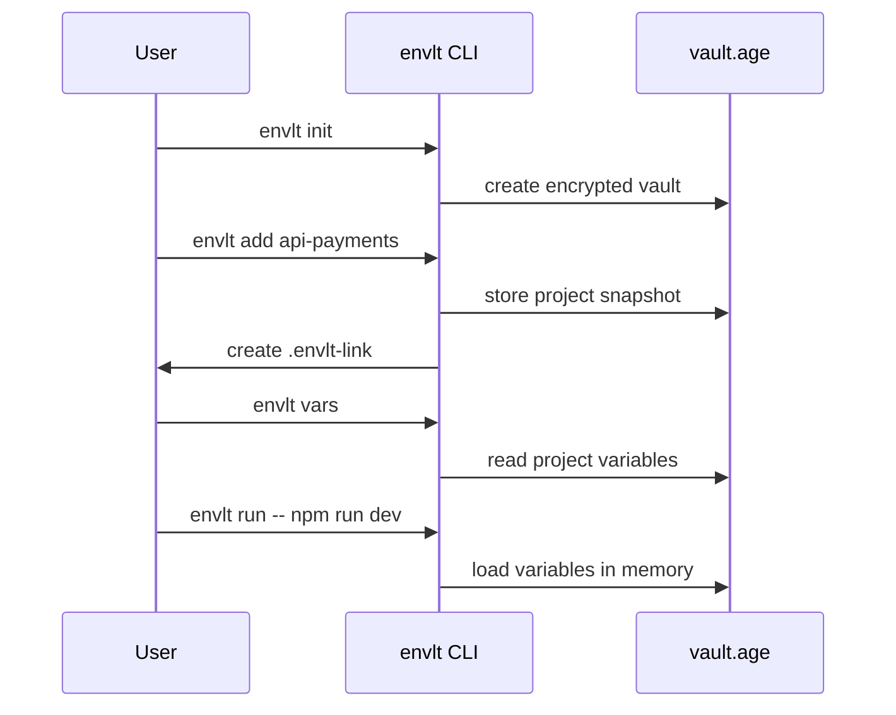

# Getting Started

This guide covers the current supported way to install and use `envlt`.

## Installation

### Install from the repository

```bash
cargo install --path crates/envlt-cli
envlt --help
```

### Install from GitHub Releases

If the project already has published release assets, you can install `envlt` manually from the release archive.

Example on Linux:

```bash
tar -xzf envlt-linux-x86_64.tar.gz
chmod +x envlt
sudo mv envlt /usr/local/bin/envlt
envlt --help
```

This is currently a manual binary installation flow, not a native package-manager install.

On macOS, downloaded binaries may carry Apple's quarantine attribute. Until signed and notarized releases are in place, remove it for trusted release binaries after extraction:

```bash
xattr -d com.apple.quarantine ./envlt
```

### Run without installing

```bash
cargo run -p envlt-cli -- --help
```

## Environment variables

| Variable | Purpose |
| --- | --- |
| `ENVLT_HOME` | Override the vault home directory |
| `ENVLT_PASSPHRASE` | Provide the vault passphrase non-interactively |
| `ENVLT_BUNDLE_PASSPHRASE` | Provide the bundle passphrase non-interactively |
| `ENVLT_GEN_TYPE` | Drive interactive `gen` selection |
| `ENVLT_GEN_SAVE` | Answer whether interactive `gen` should store the result |
| `ENVLT_GEN_SET_KEY` | Set the target key for interactive `gen` storage |
| `ENVLT_GEN_PROJECT` | Set the target project for interactive `gen` storage |

## First-run workflow



## Common workflows

### Import an existing `.env`

```bash
envlt init
envlt add api-payments
envlt vars --project api-payments
```

### Bootstrap from `.env.example`

```bash
envlt add api-payments --from-example .env.example
```

`envlt` keeps default values already present in the example file and prompts only for missing ones.

### Materialize a `.env`

```bash
envlt use --project api-payments
envlt use --project api-payments --out .env.local
```

### Run without writing `.env`

```bash
envlt run --project api-payments -- node server.js
```

### Generate and store a secret

```bash
envlt gen --type jwt-secret --set JWT_SECRET --project api-payments
envlt gen --type jwt-secret --set JWT_SECRET --project api-payments --show
```

Output policy:

- generation without storage prints the value unless `--silent`
- generation with storage prints a success message by default
- `--show` explicitly reveals the stored generated value
- `--silent` suppresses all output and conflicts with `--show`

### Share a project snapshot

```bash
envlt export api-payments --out bundle.evlt
envlt import bundle.evlt
```

### Diagnose the local setup

```bash
envlt doctor
envlt doctor --decrypt
```

## Automatic project resolution

When a directory contains `.envlt-link`, these commands can resolve the project automatically:

- `vars`
- `diff`
- `set`
- `use`
- `run`
- interactive parts of `gen`

Example `.envlt-link`:

```toml
project = "api-payments"
envlt_version = "1.0"
```

## Current limitations

- Homebrew distribution is not published yet
- macOS artifacts are not signed or notarized yet, so Gatekeeper may block them until quarantine is removed manually
- Cloud sync is not implemented
- Keychain integration is not implemented
- `gen` still lacks all planned presets
- `diff` intentionally does not provide before/after value views in this milestone
