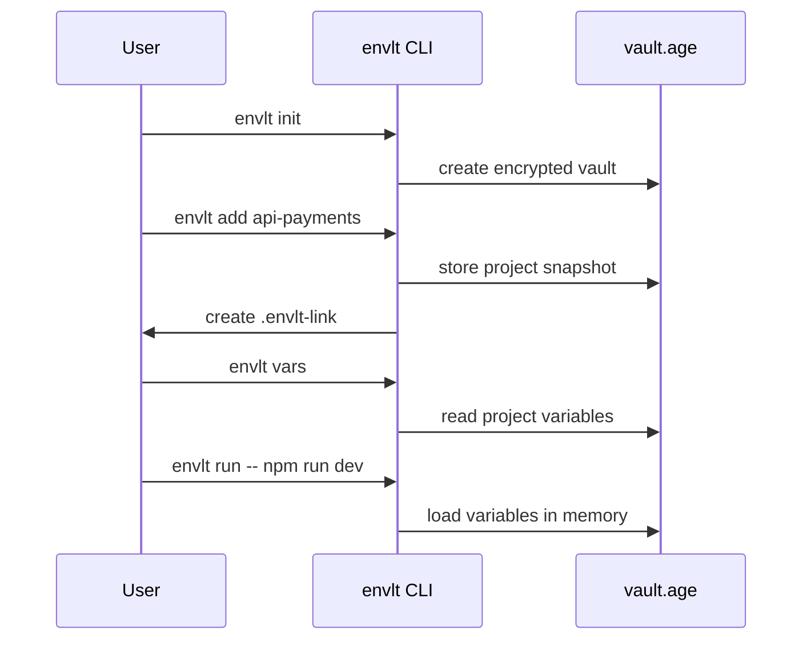

# Getting Started

This guide covers the current supported way to install and use `envlt`.

## Who this guide is for

- developers evaluating `envlt` for local-first secret management
- teams that want reproducible `.env` workflows without cloud dependency

## Outcome

By the end of this guide you will:

- create and unlock your local encrypted vault
- attach a project and verify variables
- run your app using vault-backed variables

## Installation

### Install with Homebrew

```bash
brew install obsidia-systems/tap/envlt
envlt --help
```

Homebrew is the recommended installation path on macOS and Linuxbrew-compatible environments.

### Windows through WSL

Native Windows packaging is not a current target. Windows users should install and run `envlt` inside WSL:

```bash
brew install obsidia-systems/tap/envlt
envlt --help
```

Keep the vault and project files inside the WSL filesystem when possible. This avoids path, permission, and keyring differences between Windows and Linux environments.

### Install from the repository

```bash
cargo install --path crates/envlt-cli
envlt --help
```

### Install from GitHub Releases

If the project already has published release assets, you can install `envlt` manually from the release archive.

Example on Linux:

```bash
tar -xzf envlt-linux-x86_64.tar.gz
chmod +x envlt
sudo mv envlt /usr/local/bin/envlt
envlt --help
```

This is currently a manual binary installation flow. Prefer Homebrew unless you specifically need direct release assets.

### Run without installing

```bash
cargo run -p envlt-cli -- --help
```

## Environment variables

| Variable | Purpose |
| --- | --- |
| `ENVLT_HOME` | Override the vault home directory |
| `ENVLT_PASSPHRASE` | Provide the vault passphrase non-interactively |
| `ENVLT_BUNDLE_PASSPHRASE` | Provide the bundle passphrase non-interactively |
| `ENVLT_GEN_TYPE` | Drive interactive `gen` selection |
| `ENVLT_GEN_SAVE` | Answer whether interactive `gen` should store the result |
| `ENVLT_GEN_SET_KEY` | Set the target key for interactive `gen` storage |
| `ENVLT_GEN_PROJECT` | Set the target project for interactive `gen` storage |
| `ENVLT_MAX_VERSIONS` | Override `max_versions` from `config.toml` for this process |
| `ENVLT_LOCK_TIMEOUT_MS` | Override `lock_timeout_ms` from `config.toml` for this process |

When setting `ENVLT_HOME`, prefer an absolute path so keyring lookup stays consistent across shells and working directories.

## Configuration file

`ENVLT_HOME/config.toml` (for example `~/.envlt/config.toml`) holds persistent preferences, so you don't have to export environment variables in every shell. It is entirely optional -- with no file, or with fields left out of it, `envlt` falls back to built-in defaults.

```toml
# ~/.envlt/config.toml
max_versions = 10      # default: 10
lock_timeout_ms = 5000 # default: 5000
```

`max_versions` caps how many past values each variable keeps (see [Environments](#environments) below), mirroring HashiCorp Vault KV v2's default. A `config.toml` with the older `history_limit` key still works (read as `max_versions`), but `envlt doctor` and newly written files use the current name.

Precedence for both settings is: environment variable (if set) > `config.toml` value > built-in default. `envlt doctor` reports the resolved values and where they came from under the `config` check. There is currently no `envlt config` command; edit the file directly.

## First-run workflow


```mermaid
sequenceDiagram
    participant U as User
    participant C as envlt CLI
    participant V as vault.age

    U->>C: envlt init
    C->>V: create encrypted vault
    U->>C: envlt add api-payments
    C->>V: store project snapshot
    C->>U: create .envlt-link
    U->>C: envlt vars
    C->>V: read project variables
    U->>C: envlt run -- npm run dev
    C->>V: load variables in memory
```

Expected outcome after this flow:

- a working encrypted vault at `~/.envlt/vault.age`
- one linked project through `.envlt-link`
- successful command execution with injected environment variables

## Common workflows

### Import an existing `.env`

```bash
envlt init
envlt auth save
envlt add api-payments
envlt vars --project api-payments
```

Use `envlt auth save` if you want later commands to load the vault passphrase from the system keyring instead of prompting every time.

### Bootstrap from `.env.example`

```bash
envlt add api-payments --from-example .env.example
```

`envlt` keeps default values already present in the example file and prompts only for missing ones.

### Materialize a `.env`

```bash
envlt pull --project api-payments
envlt pull --project api-payments --out .env.local
```

Use this path when tools require a file on disk.

### Run without writing `.env`

```bash
envlt run --project api-payments -- node server.js
```

Use this path when you want lower disk exposure and reproducible runtime injection.

## Decision table

| If you want to... | Use this command | Why |
| --- | --- | --- |
| Start a process with vault variables only in memory | `envlt run --project <name> -- <cmd>` | Avoid writing `.env` files |
| Create a local env file for tools that require one | `envlt pull --project <name> [--out <path>]` | Controlled materialization from encrypted state |
| Grab one variable's value for a script | `envlt get <key> --project <name>` | No need to write or parse a whole file |
| Share project variables with a teammate | `envlt export <name> --out bundle.evlt` | Portable encrypted handoff |
| Bring a shared project snapshot into your machine | `envlt import bundle.evlt` | Fast local bootstrap |
| Check local health and links | `envlt doctor [--decrypt]` | Detect setup and decryption issues early |

### Generate and store a secret

```bash
envlt gen --type jwt-secret --set JWT_SECRET --project api-payments
envlt gen --type jwt-secret --set JWT_SECRET --project api-payments --show
```

Output policy:

- generation without storage prints the value unless `--silent`
- generation with storage prints a success message by default
- `--show` explicitly reveals the stored generated value
- `--silent` suppresses all output and conflicts with `--show`

### Environments

Every project starts with one environment, `local`. Add more with `envlt env add`, and target them with `--env` on the commands that read or write variables:

```bash
envlt env add staging --project api-payments
envlt set --project api-payments --env staging DATABASE_URL=postgres://staging-host/db
envlt vars --project api-payments --env staging
envlt run --project api-payments --env staging -- node server.js
```

Variables are fully duplicated per environment: setting `DATABASE_URL` in `staging` has no effect on `local`, and `envlt vars` without `--env` always shows `local`. If you'd rather start `staging` from a copy of `local`'s current values instead of an empty environment, seed it:

```bash
envlt env add staging --project api-payments --from local
```

This is a one-time copy, not a link -- `staging` and `local` diverge independently from there.

If you work in `staging` from a given directory most of the time, pin it once instead of typing `--env staging` on every command:

```bash
envlt env switch staging --project api-payments
envlt vars --project api-payments   # now shows staging without --env
```

`envlt env remove staging --project api-payments` deletes an environment (and its variables' full history) once you no longer need it; every project must keep at least one, so the last one can't be removed. See [CLI Reference](cli-reference.md#environments) for the full list of `--env`-aware commands and the resolution order.

### Share a project snapshot

```bash
envlt export api-payments --out bundle.evlt
envlt import bundle.evlt
```

### Remove a project

```bash
envlt remove api-payments
envlt remove api-payments --yes
```

By default, `envlt` asks for confirmation before deleting a project from the vault.

### Diagnose the local setup

```bash
envlt doctor
envlt doctor --decrypt
```

### Save the vault passphrase to the system keyring

```bash
envlt auth save
envlt auth status
envlt auth clear
```

Resolution order for vault access is:

- `ENVLT_PASSPHRASE`
- stored system keyring credential
- interactive prompt

## Automatic project resolution

When the current directory (or one of its parent directories) contains `.envlt-link`, these commands can resolve the project automatically:

- `vars`
- `get`
- `diff`
- `set`
- `pull`
- `run`
- `remove`
- `doctor`
- interactive parts of `gen`

Resolution walks upward from the current directory the same way `git` finds `.git`, so it works from any subdirectory of a linked project (for example, a `packages/api` folder inside a monorepo). The closest `.envlt-link` wins if more than one exists along the way.

Example `.envlt-link`:

```toml
project = "api-payments"
envlt_version = "1.0"
```

`.envlt-link` also supports an optional `environment` field as a per-directory default for `--env`-aware commands, set with `envlt env switch <name>` (see [Environments](#environments) above).

## Current limitations

- native Windows packaging is not a current target; use WSL on Windows
- Cloud sync is not implemented
- `gen` still lacks all planned presets
- `diff` intentionally does not provide before/after value views in this milestone
- no `envlt env rename`; recreate the environment and re-set its variables instead

## Troubleshooting

If something fails during onboarding, start here:

- [Troubleshooting](troubleshooting.md)
- [CLI Reference](cli-reference.md)
