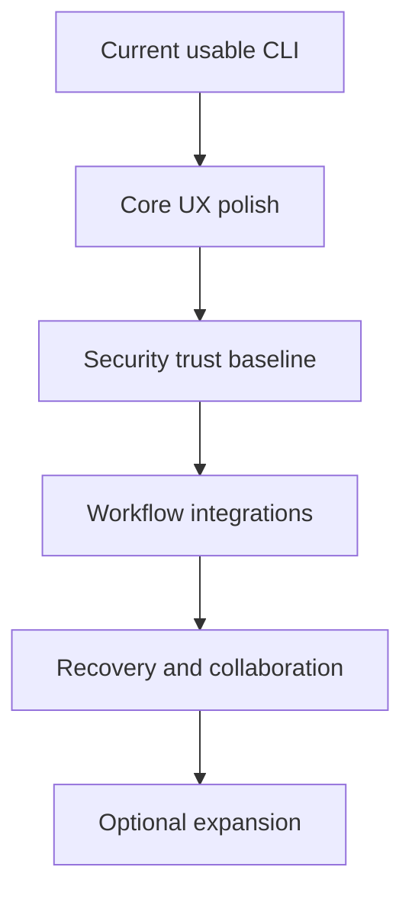

# Roadmap

This roadmap reflects the current implementation state and focuses on making `envlt` a polished local-first product.

## Product Positioning

`envlt` is not trying to become a full cloud secrets platform. Its strongest product lane is:

- local-first encrypted `.env` workflows
- no account required
- no server required
- practical onboarding for individual developers and small teams
- portable encrypted handoff through `.evlt` bundles
- Linux, macOS, and Windows through WSL

Homebrew is the recommended macOS installation path. Apple signing and notarization are not part of the near-term roadmap because the current Homebrew flow is sufficient for the intended distribution model.

## What Is Already Done

| Area | Status |
| --- | --- |
| Local encrypted vault | Done |
| Core CLI workflow (`init`, `add`, `set`, `unset`, `use`, `run`, `list`, `remove`) | Done |
| `.evlt` export/import | Done |
| Variable typing and type inference | Done |
| `.env.example` bootstrap | Done |
| Diffing | Done with a safe-summary baseline |
| Secret generation | Done with secure storage defaults |
| Diagnostics with `doctor` | Done |
| System keyring integration | Partial |
| Homebrew install path | Done |
| `.env` parser with quotes, escapes, comments, and `export` | Done |
| `.env` writer with safe quoting and roundtrip preservation | Done |
| Atomic `.env` materialization with restrictive permissions | Done |
| Shell completion generation | Done |
| `envlt check --example` for automation | Done |
| Threat model document | Done |
| Integration recipes document | Done |

## Current Gaps

| Area | Gap | Why It Matters |
| --- | --- | --- |
| Output hardening | Safe-output guarantees should be tested command by command | Users must trust that secrets are not printed accidentally |
| Recovery | Vault and bundle recovery guidance can be stronger | Users need confidence before storing important local state |
| Collaboration | Bundle import/overwrite behavior can become more transparent | Small teams need predictable handoff workflows |

## Milestone 1: Core UX Polish

Goal: make the core local workflow feel dependable across common real-world `.env` projects.

Status: **Completed**

- `.env` parser supports comments, blank lines, whitespace around `=`, empty values, single-quoted values, double-quoted values, escaped characters, and optional `export` prefixes.
- `.env` writer preserves values safely enough that `envlt add` followed by `envlt use` does not corrupt common inputs.
- `envlt use` writes atomically.
- Generated `.env` files use restrictive permissions on Unix-like platforms where possible.
- `envlt use` warns clearly that materialized `.env` files are plaintext artifacts.
- `envlt check --example` is usable as an automation check with stable exit behavior.
- Shell completion generation exists for common shells.

## Milestone 2: Security Trust Baseline

Goal: make the security posture easy to evaluate before broader adoption.

Status: **Completed**

- `docs/threat-model.md` exists and clearly states assets, guarantees, non-goals, assumptions, and user responsibilities.
- `docs/security.md` links to the threat model.
- All commands are reviewed for accidental secret output.
- Secret generation avoids avoidable modulo bias for alphabet-based generators.
- Memory-handling limitations are documented, including lack of complete zeroization.
- Use of `ENVLT_PASSPHRASE` is documented as automation-friendly but shell/environment-sensitive.

## Milestone 3: Workflow Integrations

Goal: make `envlt` easy to adopt without changing the user's stack.

Status: **Completed**

- `docs/integrations.md` includes copyable recipes for `direnv`, Docker Compose, GitHub Actions or local CI checks, VS Code tasks/debugging, and AI coding agents.
- Recommended flows prefer `envlt run` when possible and `envlt use` only when a tool requires a file.
- Docker Compose guidance explains the difference between process environment variables and Compose `.env` interpolation.
- AI-agent guidance explains which commands are safe to run without revealing secret values.
- Integration docs avoid promising plugins or cloud features that do not exist yet.

## Milestone 4: Recovery And Collaboration

Goal: improve confidence for small-team handoff and local disaster recovery.

Status: **Completed**

- Bundle import validates magic, version, and payload integrity with actionable errors.
- Overwrite behavior is explicit and documented (`--overwrite` flag).
- Vault backup recovery path is documented and the store writes backups automatically.
- `doctor` diagnoses vault, link, backup, and decryption state.
- `write_env_file` uses atomic writes with restrictive Unix permissions (`0o600`).
- Safe materialization is tested on Unix platforms.
- All features have corresponding tests (104 tests passing).

## Deferred Scope

These remain valid ideas, but they are not near-term polish work:

| Item | Status |
| --- | --- |
| Native Windows support outside WSL | Deferred |
| Cloud sync (`cloud link`, `cloud status`, `sync`) | Deferred |
| Remote conflict detection and resolution | Deferred until merge strategy is defined |
| GUI (`envlt-bar`) | Deferred |
| Apple signing and notarization | Not planned for the current distribution strategy |

## Priority Diagram

## Roadmap Policy

Near-term work should improve one of these outcomes:

1. The tool handles real `.env` files correctly.
2. The tool avoids accidental secret exposure.
3. The user can understand the security boundaries quickly.
4. The tool fits common local workflows without a cloud account.
5. Recovery and handoff behavior is predictable.
