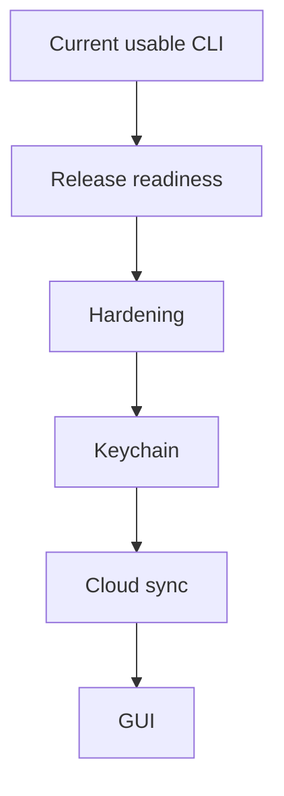

# Roadmap

This roadmap reflects the current implementation state, not the original linear phase plan from the source specification.

## Executive summary

No, the project is not feature-complete yet.

It already covers the core local workflow well, but several meaningful features are still missing before it matches the broader original vision.

## What is already done

| Area | Status |
| --- | --- |
| Local encrypted vault | Done |
| Core CLI workflow (`init`, `add`, `set`, `use`, `run`, `list`) | Done |
| `.evlt` export/import | Done |
| Variable typing and type inference | Done |
| `.env.example` bootstrap | Done |
| Diffing | Done with a safe-summary baseline |
| Secret generation | Done with secure storage defaults |
| Diagnostics with `doctor` | Done |

## What is still missing

### Near-term product and release work

| Item | Why it still matters |
| --- | --- |
| GitHub Actions for CI and release | Required for reliable public distribution |
| Homebrew tap and release artifacts | Required for polished installation |
| Better top-level release docs | Required for external users |
| Additional `gen` presets | Still optional if broader generator coverage is needed |
| Richer `diff` output | Optional only if the product wants more than safe-summary output |
| Additional output hardening | Important before broader adoption |

### Security and platform work

| Item | Status |
| --- | --- |
| Keychain integration | Not implemented |
| Secret zeroization strategy | Not implemented |
| More robust recovery and validation | Partial |

### Deferred product scope

| Item | Status |
| --- | --- |
| Cloud sync (`cloud link`, `cloud status`, `sync`) | Not implemented |
| Remote conflict detection and resolution | Not implemented |
| GUI (`envlt-bar`) | Not implemented |

## Recommended next milestones

### Milestone 1: Release readiness

- finalize the docs set
- add CI workflows
- prepare reproducible release builds
- prepare Homebrew packaging

### Milestone 2: Hardening

- improve safe output policies
- strengthen vault and bundle validation
- add better recovery guidance

### Milestone 3: Convenience

- Keychain integration
- more `gen` presets
- optional richer `diff` UX beyond the current safe-summary design

### Milestone 4: Expansion

- cloud sync
- conflict resolution
- GUI

## Priority diagram

## Roadmap policy

The current roadmap intentionally prioritizes:

1. a stable, installable CLI
2. operational safety
3. user convenience features
4. broader product expansion

That means cloud sync and GUI remain valid goals, but they are explicitly not the next step.
